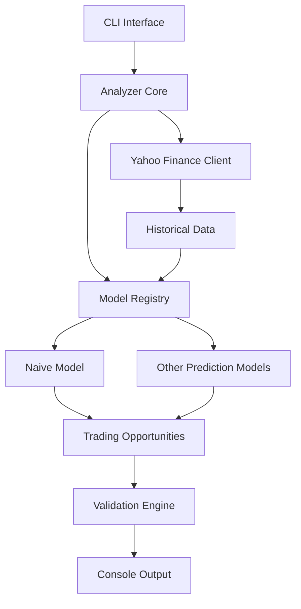

# Design Document: Stock Asset Analyzer

## Overview

The Stock Asset Analyzer is a Python 3.12 application that identifies short-term trading opportunities for stocks and cryptocurrencies. The system retrieves historical data from Yahoo Finance, processes it through multiple pluggable prediction models, and generates specific trading recommendations with entry prices, stop losses, and gain targets.

The architecture emphasizes extensibility through a registry pattern for prediction models, allowing developers to add new prediction strategies without modifying core system code. The validation engine aggregates opportunities across models to identify high-confidence recommendations where multiple models agree.

The system operates as a command-line tool, making it suitable for both interactive use and integration into automated trading workflows.

## Architecture

The system follows a pipeline architecture with clear separation of concerns:



The architecture consists of five primary layers:

1. **Interface Layer**: CLI argument parsing and user interaction
2. **Orchestration Layer**: Analyzer core that coordinates the analysis pipeline
3. **Data Retrieval Layer**: Yahoo Finance client for fetching historical data
4. **Model Layer**: Registry and pluggable prediction models
5. **Validation Layer**: Aggregation and consensus analysis of opportunities

This layered approach ensures that data flows unidirectionally through the system, making it easier to reason about state and debug issues. The registry pattern in the model layer provides the extensibility required for experimentation with different prediction strategies.

## Components and Interfaces

### Yahoo Finance Client

Responsible for retrieving historical asset data from Yahoo Finance API.

```python
class YahooFinanceClient:
    def fetch_historical_data(self, symbol: str, period: str = "1mo") -> HistoricalData:
        """
        Fetch historical data for a given symbol.
        
        Args:
            symbol: Asset symbol (e.g., "AAPL", "BTC-USD")
            period: Time period for historical data (default: "1mo")
            
        Returns:
            HistoricalData object containing price and volume information
            
        Raises:
            SymbolNotFoundError: If the symbol is invalid
            ServiceUnavailableError: If Yahoo Finance API is unreachable
            NetworkError: If network connectivity fails
        """
```

The client wraps the yfinance library and provides error handling for common failure modes. It normalizes the data format regardless of whether the asset is a stock or cryptocurrency.

### Model Registry

Manages the collection of available prediction models and provides discovery mechanisms.

```python
class ModelRegistry:
    def register(self, model: PredictionModel) -> None:
        """Register a new prediction model."""
        
    def get_all_models(self) -> list[PredictionModel]:
        """Retrieve all registered models."""
        
    def get_model_by_id(self, model_id: str) -> PredictionModel | None:
        """Retrieve a specific model by identifier."""
```

The registry uses a simple list-based storage mechanism. Models are registered at application startup through explicit registration calls or automatic discovery via entry points.

### Prediction Model Interface

Defines the contract that all prediction models must implement.

```python
class PredictionModel(ABC):
    @property
    @abstractmethod
    def model_id(self) -> str:
        """Unique identifier for this model."""
        
    @abstractmethod
    def analyze(self, data: HistoricalData) -> list[TradingOpportunity]:
        """
        Analyze historical data and generate trading opportunities.
        
        Args:
            data: Historical price and volume data
            
        Returns:
            List of trading opportunities (may be empty)
        """
```

This interface ensures all models can be used interchangeably by the analyzer core. Models are free to implement any prediction strategy as long as they conform to this interface.

### Naive Model

A baseline implementation using simple statistical methods.

```python
class NaiveModel(PredictionModel):
    def __init__(self, stop_loss_pct: float = 0.05, gain_target_pct: float = 0.10):
        """
        Initialize naive model with configurable risk parameters.
        
        Args:
            stop_loss_pct: Percentage below entry for stop loss (default: 5%)
            gain_target_pct: Percentage above entry for gain target (default: 10%)
        """
```

The naive model uses a simple strategy: identify recent upward price momentum and generate an opportunity with the current price as entry, stop loss at 5% below, and gain target at 10% above. This provides a baseline for comparing more sophisticated models.

### Validation Engine

Aggregates opportunities from multiple models and identifies consensus.

```python
class ValidationEngine:
    def validate(self, opportunities: list[TradingOpportunity]) -> ValidationResult:
        """
        Aggregate and validate opportunities across models.
        
        Args:
            opportunities: All opportunities from all models
            
        Returns:
            ValidationResult with sorted and annotated opportunities
        """
```

The engine groups opportunities by asset symbol, counts how many models support each opportunity, and calculates consensus metrics when multiple models suggest similar entry prices (within 2% of each other).

### Analyzer Core

Orchestrates the entire analysis pipeline.

```python
class Analyzer:
    def __init__(self, client: YahooFinanceClient, registry: ModelRegistry, 
                 validator: ValidationEngine):
        """Initialize analyzer with required components."""
        
    def analyze_symbol(self, symbol: str) -> ValidationResult:
        """
        Analyze a symbol and return validated trading opportunities.
        
        Args:
            symbol: Asset symbol to analyze
            
        Returns:
            ValidationResult containing all opportunities
            
        Raises:
            SymbolNotFoundError: If symbol is invalid
            ServiceUnavailableError: If data retrieval fails
        """
```

The analyzer retrieves historical data, passes it through all registered models, collects the opportunities, and validates them through the validation engine.

## Data Models

### HistoricalData

Represents time-series price and volume data for an asset.

```python
@dataclass
class HistoricalData:
    symbol: str
    data: pd.DataFrame  # Columns: date, open, high, low, close, volume
    retrieved_at: datetime
    
    def __post_init__(self):
        """Validate that required columns are present."""
        required_cols = {'open', 'high', 'low', 'close', 'volume'}
        if not required_cols.issubset(set(self.data.columns)):
            raise ValueError(f"Missing required columns: {required_cols - set(self.data.columns)}")
```

Uses pandas DataFrame for efficient time-series operations. The data is indexed by date and includes OHLCV (Open, High, Low, Close, Volume) data.

### TradingOpportunity

Represents a specific trading recommendation.

```python
@dataclass
class TradingOpportunity:
    symbol: str
    entry_price: Decimal
    stop_loss_price: Decimal
    gain_target_price: Decimal
    model_id: str
    generated_at: datetime
    
    def __post_init__(self):
        """Validate price relationships."""
        if not (self.stop_loss_price < self.entry_price < self.gain_target_price):
            raise ValueError("Invalid price relationship: stop_loss < entry < gain_target required")
```

Uses Decimal for precise financial calculations. The post-init validation ensures that price relationships are always correct.

### ValidationResult

Contains aggregated and validated opportunities.

```python
@dataclass
class ValidationResult:
    opportunities: list[TradingOpportunity]
    consensus_opportunities: list[ConsensusOpportunity]
    model_count: int
    
@dataclass
class ConsensusOpportunity:
    symbol: str
    supporting_models: list[str]
    avg_entry_price: Decimal
    avg_stop_loss_price: Decimal
    avg_gain_target_price: Decimal
    confidence_score: float  # 0.0 to 1.0 based on model agreement
```

The validation result separates individual opportunities from consensus opportunities where multiple models agree. The confidence score is calculated as (supporting_models / total_models).

### Custom Exceptions

```python
class SymbolNotFoundError(Exception):
    """Raised when an invalid symbol is provided."""
    
class ServiceUnavailableError(Exception):
    """Raised when Yahoo Finance API is unreachable."""
    
class NetworkError(Exception):
    """Raised when network connectivity fails."""
    
class InsufficientDataError(Exception):
    """Raised when historical data is insufficient for analysis."""
```

Custom exceptions provide clear error semantics and allow for specific error handling strategies.


## Correctness Properties

A property is a characteristic or behavior that should hold true across all valid executions of a system—essentially, a formal statement about what the system should do. Properties serve as the bridge between human-readable specifications and machine-verifiable correctness guarantees.

### Property 1: Valid Symbol Data Retrieval

For any valid asset symbol (stock or cryptocurrency), when the Yahoo Finance client fetches historical data, the returned HistoricalData object must contain a DataFrame with the required columns: open, high, low, close, and volume.

**Validates: Requirements 1.1, 1.2, 1.4**

### Property 2: Invalid Symbol Error Handling

For any invalid or malformed symbol, when the Yahoo Finance client attempts to fetch data, it must raise a SymbolNotFoundError.

**Validates: Requirements 1.3, 8.3**

### Property 3: Model Registry Maintains Registered Models

For any sequence of model registration operations, when querying the registry for all models, the returned list must contain exactly the models that were registered, in the order they were registered.

**Validates: Requirements 2.1, 2.2**

### Property 4: Model Analyze Returns Valid Opportunities

For any prediction model and any historical data, when the model's analyze method is called, it must return a list where every element is a valid TradingOpportunity instance.

**Validates: Requirements 2.4**

### Property 5: Analyzer Invokes All Models

For any set of registered models and any symbol, when the analyzer processes that symbol, each registered model's analyze method must be invoked exactly once (unless a model raises an exception).

**Validates: Requirements 2.5**

### Property 6: Naive Model Stop Loss Calculation

For any trading opportunity generated by the naive model, the stop loss price must equal the entry price multiplied by (1 - stop_loss_percentage), within floating point precision tolerance.

**Validates: Requirements 3.3**

### Property 7: Naive Model Gain Target Calculation

For any trading opportunity generated by the naive model, the gain target price must equal the entry price multiplied by (1 + gain_target_percentage), within floating point precision tolerance.

**Validates: Requirements 3.4**

### Property 8: Insufficient Data Handling

For any historical data with fewer than the minimum required rows (e.g., less than 5 days), when the naive model analyzes it, the result must be an empty list of opportunities.

**Validates: Requirements 3.5**

### Property 9: Trading Opportunity Invariants

For any TradingOpportunity instance, the following invariants must hold:
- stop_loss_price < entry_price < gain_target_price
- All price fields must be positive Decimal values
- model_id must be a non-empty string
- generated_at must be a valid datetime
- symbol must be a non-empty string

**Validates: Requirements 4.1, 4.2, 4.3, 4.4, 4.5**

### Property 10: Validation Engine Aggregates All Opportunities

For any list of trading opportunities from multiple models for the same symbol, when the validation engine processes them, the resulting ValidationResult must contain all input opportunities.

**Validates: Requirements 5.1**

### Property 11: Consensus Detection

For any set of opportunities where two or more models suggest entry prices within 2% of each other for the same symbol, when the validation engine processes them, those opportunities must appear in the consensus_opportunities list.

**Validates: Requirements 5.2**

### Property 12: Consensus Metrics Calculation

For any consensus opportunity, the average entry price must equal the mean of all supporting opportunities' entry prices, and the confidence score must equal (number of supporting models / total number of models).

**Validates: Requirements 5.3**

### Property 13: Opportunities Sorted by Support

For any validation result with multiple opportunities, the opportunities list must be sorted in descending order by the number of models that generated similar opportunities.

**Validates: Requirements 5.5**

### Property 14: CLI Symbol Processing

For any valid symbol provided as a command-line argument, when the CLI processes it, the analyzer must be invoked with that exact symbol.

**Validates: Requirements 7.1**

### Property 15: CLI Output Completeness

For any set of trading opportunities generated by the analyzer, when displayed to the console, every opportunity must appear in the output with all its fields (symbol, entry, stop loss, gain target, model).

**Validates: Requirements 7.3**

### Property 16: Exit Code Correctness

For any execution of the analyzer, the exit code must be zero if and only if the analysis completed without errors. Any error condition must result in a non-zero exit code.

**Validates: Requirements 7.4, 7.5**

### Property 17: Model Fault Isolation

For any set of registered models where one or more models raise exceptions during analysis, when the analyzer processes historical data, all non-failing models must still be invoked and their opportunities must be included in the result.

**Validates: Requirements 8.2**

### Property 18: Error Logging Completeness

For any error that occurs during analysis, when the error is logged, the log entry must include a timestamp, the error message, and contextual information (symbol being analyzed, model that failed, etc.).

**Validates: Requirements 8.5**

## Error Handling

The system implements a layered error handling strategy:

### Data Retrieval Layer

The Yahoo Finance client catches exceptions from the yfinance library and translates them into domain-specific exceptions:
- HTTP 404 responses become SymbolNotFoundError
- Connection timeouts become NetworkError
- HTTP 5xx responses become ServiceUnavailableError

All exceptions include the original error message and the symbol that was being queried.

### Model Execution Layer

The analyzer wraps each model's analyze call in a try-except block. When a model raises an exception:
1. The error is logged with the model ID and full traceback
2. The exception is caught and does not propagate
3. Analysis continues with the remaining models
4. The final result includes a warning about which models failed

This ensures that one faulty model cannot prevent other models from running.

### CLI Layer

The CLI entry point catches all exceptions and handles them appropriately:
- Domain exceptions (SymbolNotFoundError, etc.) display user-friendly messages
- Unexpected exceptions display the error type and message, plus a suggestion to check logs
- All errors result in non-zero exit codes
- Stack traces are written to the log file but not displayed to users

### Validation Layer

The validation engine is defensive about input:
- Empty opportunity lists are handled gracefully (return empty ValidationResult)
- Opportunities with invalid price relationships are filtered out with a warning
- Missing or None values in opportunities are logged and those opportunities are skipped

### Logging Strategy

All components use Python's logging module with the following configuration:
- Console handler: WARNING level and above
- File handler: DEBUG level and above
- Log file location: `~/.stock-analyzer/analyzer.log`
- Log format: `%(asctime)s - %(name)s - %(levelname)s - %(message)s`
- Automatic log rotation at 10MB with 5 backup files

Critical information logged:
- All API calls to Yahoo Finance (symbol, timestamp, success/failure)
- Model registration events
- Model execution (start, end, duration, opportunity count)
- All exceptions with full context
- Validation results (consensus count, total opportunities)

## Testing Strategy

The system requires comprehensive testing using both unit tests and property-based tests to ensure correctness.

### Property-Based Testing

Property-based testing will be implemented using the Hypothesis library for Python. Each correctness property defined above will be implemented as a property-based test.

Configuration:
- Minimum 100 iterations per property test
- Each test must include a comment tag referencing the design property
- Tag format: `# Feature: stock-asset-analyzer, Property {number}: {property_text}`

Example property test structure:

```python
from hypothesis import given, strategies as st

# Feature: stock-asset-analyzer, Property 9: Trading Opportunity Invariants
@given(
    entry=st.decimals(min_value=Decimal("0.01"), max_value=Decimal("100000")),
    stop_loss_pct=st.floats(min_value=0.01, max_value=0.2),
    gain_target_pct=st.floats(min_value=0.01, max_value=0.5)
)
def test_trading_opportunity_invariants(entry, stop_loss_pct, gain_target_pct):
    stop_loss = entry * Decimal(str(1 - stop_loss_pct))
    gain_target = entry * Decimal(str(1 + gain_target_pct))
    
    opp = TradingOpportunity(
        symbol="TEST",
        entry_price=entry,
        stop_loss_price=stop_loss,
        gain_target_price=gain_target,
        model_id="test_model",
        generated_at=datetime.now()
    )
    
    assert opp.stop_loss_price < opp.entry_price < opp.gain_target_price
    assert all(p > 0 for p in [opp.entry_price, opp.stop_loss_price, opp.gain_target_price])
```

Property tests will focus on:
- Invariants (price relationships, data structure requirements)
- Round-trip properties (serialization if implemented)
- Metamorphic properties (e.g., adding more models increases or maintains opportunity count)
- Error conditions (invalid inputs produce appropriate errors)

### Unit Testing

Unit tests complement property tests by covering:
- Specific examples that demonstrate correct behavior
- Edge cases (empty data, single data point, extreme values)
- Integration points between components
- Mock-based tests for external dependencies (Yahoo Finance API)

Unit test coverage areas:
- Yahoo Finance client with mocked API responses
- Model registry registration and retrieval
- Naive model with known input/output pairs
- Validation engine with specific opportunity sets
- CLI argument parsing with various input formats
- Error handling paths with specific error conditions

Example unit test:

```python
def test_validation_engine_empty_input():
    """Test that empty opportunity list returns empty result."""
    engine = ValidationEngine()
    result = engine.validate([])
    
    assert result.opportunities == []
    assert result.consensus_opportunities == []
    assert result.model_count == 0
```

### Integration Testing

Integration tests verify the complete pipeline:
- End-to-end tests with real Yahoo Finance API calls (marked as slow tests)
- CLI tests that invoke the main entry point and verify output
- Multi-model scenarios with various combinations of models

### Test Organization

```
tests/
├── unit/
│   ├── test_yahoo_client.py
│   ├── test_model_registry.py
│   ├── test_naive_model.py
│   ├── test_validation_engine.py
│   └── test_cli.py
├── property/
│   ├── test_properties_data.py
│   ├── test_properties_models.py
│   ├── test_properties_validation.py
│   └── test_properties_cli.py
└── integration/
    ├── test_end_to_end.py
    └── test_multi_model.py
```

### Test Execution

- Unit tests: Run on every commit (fast, < 5 seconds)
- Property tests: Run on every commit (moderate, < 30 seconds with 100 iterations)
- Integration tests: Run before merge to main (slow, may take minutes due to API calls)

Use pytest with the following plugins:
- pytest-cov for coverage reporting (target: 90% coverage)
- pytest-mock for mocking
- hypothesis for property-based testing
- pytest-timeout to prevent hanging tests
